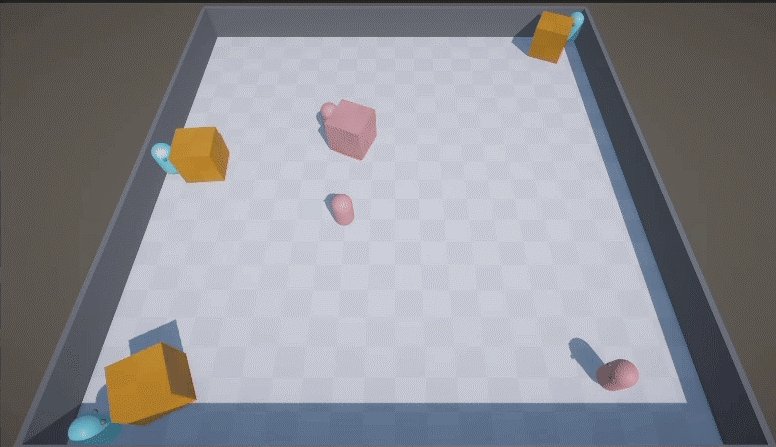

# Hide-and-Seek (Unity ML-Agents) Multi-Agent Reinforcement Learning Project



This repository contains a Unity **Hide-and-Seek** environment and a complete workflow to **train**, **evaluate**, and **export** reinforcement learning (RL) policies using **Unity ML-Agents**.  
It was developed as an exam/project submission for **Applied Reinforcement Learning (University of Genoa)**.


---

## Purpose of the Project

The objective is to build and train **autonomous agents** that learn behaviors through interaction in a **multi-agent** environment.
The focus is on the full RL pipeline:

- environment setup in Unity,
- formulation in RL terms (state/action/reward),
- training configuration and monitoring (TensorBoard),
- exporting policies to ONNX for inference inside Unity without Python.

A full step-by-step report (build + training + TensorBoard screenshots) is included as:
- `Hide_and_Seek_MLAgents_Training_Report_with_TensorBoard.pdf`

---

## Problem Description and Environment

### Task
Two teams of agents (hiders and seekers) operate in the same simulated arena.  
Agents must learn policies that maximize cumulative return while interacting with teammates/opponents.

### Unity Scenes
- **Training scene:** `Assets/Scenes/Training.unity`  
- **Test (inference) scene:** `Assets/Scenes/Test.unity` 

### Why train from an executable (not the Unity Editor)
Training uses a **built executable** because it is faster and supports **headless** execution (`--no-graphics`) without Unity Editor overhead.
---

## Reinforcement Learning Formulation

The task is modeled as a **(multi-agent) Markov Decision Process** where each agent selects actions based on observations to maximize expected discounted return.

| Component | Definition (this environment) | Notes / Rationale |
|---|---|---|
| **Observation / State** | Multi-tensor observations. For each team behavior, ML-Agents exposes shapes: `[(3,8), (210,), (210,), (9,)]`  | These are provided by the Unity environment. We discovered them programmatically from the built executable to ensure the trainer configuration matches the behavior specs. |
| **Action Space** | Hybrid action spec: **Continuous: 3**, **Discrete branches: (2, 3)**  | A hybrid policy is required: continuous controls (e.g., movement) + discrete choices (e.g., toggles / interactions). |
| **Reward** | Environment-defined rewards + **group reward signals** observed during training logs fileciteturn3file1 | The environment emits individual and group rewards; group rewards are important for multi-agent coordination. |
| **Episode Termination** | Environment-defined (e.g., time limit, capture/escape conditions) | Termination conditions are handled in Unity scripts; evaluation is done by monitoring learning curves and qualitative behavior in the Test scene. |
| **Objective** | Maximize discounted cumulative reward | Standard RL objective; training uses policy-gradient methods (PPO / POCA). |

---

## Algorithmic Approach

### Baseline Trainer (this repo)
We trained a baseline using **PPO (Proximal Policy Optimization)** with Unity ML-Agents.  
This is a strong default for continuous and hybrid action spaces.

**Why PPO here**
- Stable on-policy updates with clipped objective (robust against destructive policy updates).
- Works well for continuous control and multi-sensor observations.

The baseline YAML is `ml-agents_config.yaml` and includes:  
batch size, buffer size, learning rate schedules, network size, and training horizon. fileciteturn3file1

### Multi-Agent Note (important)
The environment has **multiple teams** and emits **group rewards**, which is why ML-Agents warns that PPO is not ideal for adversarial/multi-agent settings.  
For genuine multi-agent coordination training, Unity recommends **POCA** (multi-agent trainer) for group reward settings.

---

## Implementation Details

### Languages & Tools
- **C#**: Unity environment + agent logic
- **ShaderLab / HLSL**: Unity rendering pipeline (URP)
- **Python**: training loop via `mlagents-learn`
- **YAML**: trainer configuration

### Versions (tested)
- Unity Editor: **2022.3.62f3 (LTS)**  
- Unity ML-Agents (C# package detected at runtime): **2.3.0-exp.2** 
- Python (Conda): **3.8.18**  
- `mlagents` / `mlagents_envs`: **0.30.0**  
- PyTorch: **1.7.1 + CUDA 11.0 build**  
- `protobuf`: **3.20.3** (required for ML-Agents 0.30.0)  

---

## Repository Structure

```
.
├── Assets/
│   ├── Scenes/                    # Training.unity, Test.unity
│   ├── NNModels/                  # Exported ONNX policies used for inference
│   └── ...
├── Builds/Training/               # Unity training executable output
├── results/                       # TensorBoard logs + checkpoints
├── ml-agents_config.yaml          # PPO trainer configuration (baseline)
└── Hide_and_Seek_MLAgents_Training_Report_with_TensorBoard.pdf
```

---

## Experimental Setup and Evaluation

### 1) Create / activate the Python environment
The report documents the exact conda + pip steps, including fixes for `protobuf` and `six`. 

### 2) Build the Training executable (Unity)
- Add `Assets/Scenes/Training.unity` in **Build Settings → Scenes In Build**
- Target: Windows x86_64
- Output folder: `Builds/Training/`

### 3) Train the agent (baseline PPO)
Run from the project root:

```powershell
mlagents-learn "ml-agents_config.yaml" --env "Builds\Training\unity-ml-agents_hide-and-seek.exe" --run-id hns_run1 --force --no-graphics --time-scale 20
```

This should print successful connection lines like:
- `Connected new brain: HideAndSeekAgent?team=0`
- `Connected new brain: HideAndSeekAgent?team=1` 

### 4) Monitor in TensorBoard

```powershell
tensorboard --logdir results
```

Open: `http://localhost:6006` 

### Metrics used
- **Environment/Cumulative Reward** (learning progress proxy)
- **Losses/Policy Loss** and **Losses/Value Loss** (optimization stability)
- Additional environment scalars (e.g., agent positions)
---

## Exported Models (ONNX)

ML-Agents exports ONNX policies periodically (at checkpoint intervals).

### Models included in this repo (`Assets/NNModels/`)
- **POCA model (multi-agent):** `HideAndSeekAgent-1857600.onnx` *(provided as a stronger multi-agent policy artifact)*
- **PPO baseline model:** `PPO_HideAndSeekAgent-699900.onnx`

> The latest policy is typically the ONNX file with the highest step number in its filename.

---

## Results and Discussion (Summary)

- Training produced stable optimization curves (value loss decreases; policy loss remains bounded).   
- Cumulative reward shows improvement over steps, but remains noisy—expected in multi-agent/adversarial settings.  
- ML-Agents warnings highlight that PPO is not the best fit for multi-team adversarial games without self-play or a multi-agent trainer (POCA).

For detailed plots and screenshots, see the PDF report appendix.

---

## How to Run Inference (Test Scene)

To run a trained policy inside Unity (no Python):

1. Stop training (`Ctrl + C`).
2. Open `Assets/Scenes/Test.unity`.  
3. For each agent object: `Behavior Parameters`
   - Set **Behavior Type = Inference Only**
   - Assign a model from `Assets/NNModels/*.onnx`  
4. Press **Play**.

---

## References

- Unity ML-Agents Toolkit documentation (installation + training workflow).  
- PPO (Schulman et al.) — Proximal Policy Optimization.
- POCA (Unity ML-Agents multi-agent trainer) — recommended when group rewards / coordination are central.
- OpenAI — Emergent Tool Use From Multi-Agent Autocurricula (Hide-and-Seek), 2019. (Blog post / project write-up).
- Baker, B., Kanitscheider, I., Markov, T., Wu, Y., Powell, G., McGrew, B., Mordatch, I. — Emergent Tool Use From Multi-Agent Autocurricula, 2019. (arXiv preprint / paper version of the Hide-and-Seek work).
- OpenAI — Spinning Up in Deep RL (background on policy gradients, PPO, training tips), 2018.
- Unity Technologies — ML-Agents Toolkit Documentation (training, behavior parameters, inference models, TensorBoard logging).
- Unity Technologies — ML-Agents GitHub Repository (source, releases, trainer configs, examples).
- Schulman, J., Wolski, F., Dhariwal, P., Radford, A., Klimov, O. — Proximal Policy Optimization Algorithms, 2017.
- Sutton, R. S., Barto, A. G. — Reinforcement Learning: An Introduction, 2nd ed., MIT Press, 2018.
- Morales, M. — Grokking Deep Reinforcement Learning, Manning, 2020.


---

## Academic Use and Attribution

This repository is provided for academic evaluation and reproducibility.  
If you reuse parts of the project, credit the original authors and respect any license files included.
